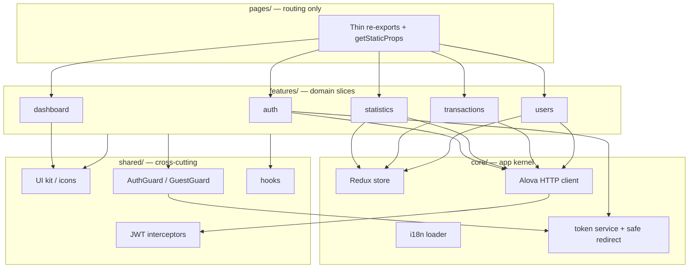
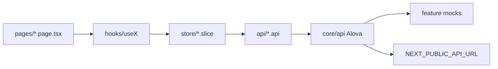

# FINKING

Feature-sliced financial operations dashboard. Next.js Pages Router stays a thin routing surface; each domain owns its page, API, Redux slice, mocks, and public barrel.

Built with React 19, TypeScript, Redux Toolkit, Alova, Tailwind CSS v4, and next-intl.


## Features

- **Statistics**: KPI overview, monthly revenue chart, and category distribution
- **Users**: Search, filter, create, and edit users with role and status management
- **Transactions**: Paginated history, detail view, filters, and CSV/JSON export
- **Auth**: JWT access/refresh flow with `AuthGuard` / `GuestGuard` and silent refresh on 401
- **Local mocks**: `@alova/mock` is enabled by default so the app runs without a backend

## Architecture

The app is split by **domain**, not by file type. A route in `pages/` does not contain feature logic — it re-exports a page from `features/*` and preloads messages. Cross-cutting kernel code lives in `core/`. UI kit, guards, and hooks live in `shared/`. Features must not import each other's internals; they go through public barrels (`features/<domain>/index.ts`).



### Feature slice

Each domain follows the same internals. Example: `features/transactions`.

```
features/transactions/
  pages/          Screen composed from shared UI + domain hook
  components/     Filter modal and other slice-only widgets
  hooks/          useTransactions — page API over Redux
  store/          RTK slice + async thunks
  api/            Alova endpoints
  mocks/          @alova/mock handlers
  interfaces/     DTOs and view models
  index.ts        Public barrel
```



### Request and auth flow

```mermaid
sequenceDiagram
  participant Page
  participant Hook
  participant Slice
  participant Alova
  participant Interceptor
  participant Backend

  Page->>Hook: render / user action
  Hook->>Slice: dispatch thunk
  Slice->>Alova: api.getX().send()
  Alova->>Interceptor: attach Bearer token
  alt mocks enabled
    Interceptor-->>Slice: feature mock payload
  else live API
    Alova->>Backend: HTTP
    Backend-->>Alova: 200 or 401
    alt 401
      Interceptor->>Backend: refresh token
      Interceptor->>Alova: retry original request
    end
    Alova-->>Slice: data
  end
  Slice-->>Page: loading / data / pagination
```



Guards sit outside Redux: `tokenService` is the source of truth for session, `AuthGuard` / `GuestGuard` protect routes, and `safe-redirect` blocks open redirects after login.

```
pages/                 Next.js routing surface only
features/
  auth/                login, JWT API, mocks
  dashboard/           shell: sidebar, layout, header
  statistics/          KPIs, chart, category table
  transactions/        list, details, filters, export
  users/               list, create/edit, filters
core/
  api/                 Alova instance + mock toggle
  auth/                tokens, open-redirect guard
  i18n/                message loading
  store/               combines feature reducers
shared/
  components/          UI kit + route guards
  hooks/               escape, body lock, click-outside
  interceptors/        JWT attach + silent refresh on 401
```

## Tech stack

| Technology | Role |
| --- | --- |
| Next.js 16 | Pages Router, SSG message preloading |
| React 19 | UI |
| TypeScript 5 | Typing |
| Redux Toolkit | Domain state (`useUsers`, `useTransactions`, `useStatistics`) |
| Alova 3 | HTTP client, interceptors, mocks |
| Tailwind CSS v4 | Styling (`@theme` tokens) |
| next-intl | Domain-scoped messages |
| Oxlint + ESLint | Linting |

## Quick start

**Prerequisites:** Node.js 20+ and npm 10+

```bash
git clone https://github.com/swe-rashad/FINKING-FRONTEND.git
cd FINKING-FRONTEND
npm install
npm run dev
```

Open [http://localhost:3000](http://localhost:3000).

Demo login:

- Email: `rashad.yusifli@finking.com`
- Password: `Password123!`

## Configuration

Copy values into `.env.local`:

```env
NEXT_PUBLIC_ENABLE_MOCKS=true
NEXT_PUBLIC_API_URL=http://localhost:8080
```

Set `NEXT_PUBLIC_ENABLE_MOCKS=false` to hit the live API.

Runtime toggle in the browser console:

```js
window.__FINKING_MOCKS__.setEnabled(false);
window.__FINKING_MOCKS__.setEnabled(true);
```

## Scripts

| Script | Description |
| --- | --- |
| `npm run dev` | Development server (port 3000) |
| `npm run build` | Production build |
| `npm run start` | Production server |
| `npm run typecheck` | TypeScript check |
| `npm run lint` | Oxlint + ESLint |
| `npm run lint:oxlint` | Oxlint only |
| `npm run lint:eslint` | ESLint only |

## License

MIT
