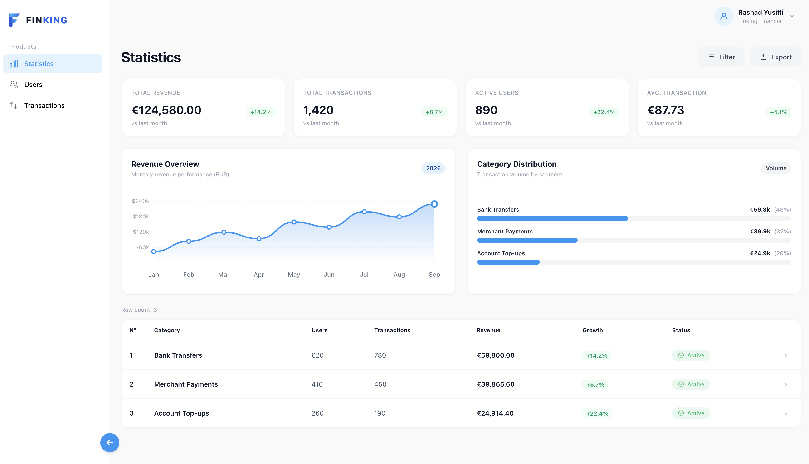

# FINKING

Financial operations dashboard built with Next.js (Pages Router), React 19, TypeScript, Redux Toolkit, Alova, Tailwind CSS v4, and next-intl.



## Features

- **Statistics**: KPI overview, monthly revenue chart, and category distribution
- **Users**: Search, filter, create, and edit users with role and status management
- **Transactions**: Paginated history, detail view, filters, and CSV/JSON export
- **Auth**: JWT access/refresh flow with `AuthGuard` / `GuestGuard` and silent refresh on 401
- **Local mocks**: `@alova/mock` is enabled by default so the app runs without a backend

## Architecture

```
pages/        Thin Next.js routes (`getStaticProps` + locale loading)
features/     Domain modules: auth, dashboard, statistics, transactions, users
core/         Store, HTTP client, i18n, token helpers
shared/       UI primitives, icons, guards, hooks
```

## Tech stack

| Technology | Role |
| --- | --- |
| Next.js 16 | Pages Router, SSG message preloading |
| React 19 | UI |
| TypeScript 5 | Typing |
| Redux Toolkit | Domain state (`useUsers`, `useTransactions`, `useStatistics`) |
| Alova 3 | HTTP client, interceptors, mocks |
| Tailwind CSS v4 | Styling (`@theme` tokens) |
| next-intl | Domain-scoped messages |
| Oxlint + ESLint | Linting |

## Quick start

**Prerequisites:** Node.js 20+ and npm 10+

```bash
git clone https://github.com/swe-rashad/FINKING-FRONTEND.git
cd FINKING-FRONTEND
npm install
npm run dev
```

Open [http://localhost:3000](http://localhost:3000).

Demo login:

- Email: `rashad.yusifli@finking.com`
- Password: `Password123!`

## Configuration

Copy values into `.env.local`:

```env
NEXT_PUBLIC_ENABLE_MOCKS=true
NEXT_PUBLIC_API_URL=http://localhost:8080
```

Set `NEXT_PUBLIC_ENABLE_MOCKS=false` to hit the live API.

Runtime toggle in the browser console:

```js
window.__FINKING_MOCKS__.setEnabled(false);
window.__FINKING_MOCKS__.setEnabled(true);
```

## Scripts

| Script | Description |
| --- | --- |
| `npm run dev` | Development server (port 3000) |
| `npm run build` | Production build |
| `npm run start` | Production server |
| `npm run typecheck` | TypeScript check |
| `npm run lint` | Oxlint + ESLint |
| `npm run lint:oxlint` | Oxlint only |
| `npm run lint:eslint` | ESLint only |

## License

MIT
