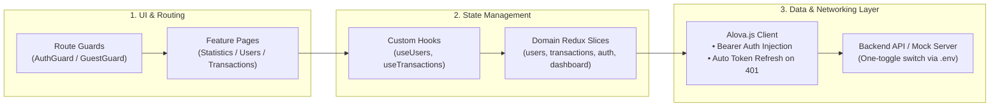

# FINKING — Modern Financial Dashboard

A modern, production-ready fintech dashboard built with **Next.js (Pages Router)**, **TypeScript**, **Redux Toolkit**, **Tailwind CSS**, and **Alova.js**.

---

## ⚡ At a Glance: Frontend Architecture

Designed with a **Feature-Sliced architecture** for maintainability, domain isolation, and scalability. Here is how data, state, and UI flow across the frontend:



---

## 🚀 Key Architectural Highlights

### 1. 🛡️ Robust Route Protection & Auth Flow
- **`AuthGuard`**: Protects all dashboard routes (`/dashboard/*`). If tokens are missing or invalid, redirects to `/auth/login?redirect=<target>`.
- **`GuestGuard`**: Prevents logged-in users from accessing `/auth/login` by auto-redirecting to `/dashboard/statistics`.
- **Root redirector**: Intelligently routes `/` based on authentication status.

### 2. 🔄 Silent Token Refresh & Resilient Interceptor
- Every outgoing API request automatically receives `Authorization: Bearer <authToken>`.
- When an access token expires (`401 Unauthorized`), the interceptor automatically calls `/api/auth/refresh` using the `refreshToken`.
- Upon successful renewal, the original request is **automatically replayed** — zero interruption to the user experience.

### 3. 🧩 Domain-Sliced Modular Design
Instead of a monolithic codebase, features are organized by business domain:
- Each feature (`features/users`, `features/transactions`, `features/statistics`, `features/auth`) owns its:
  - **`pages/`**: View components & Next.js page layouts
  - **`store/`**: Dedicated Redux slice & async thunks
  - **`api/`**: Strongly-typed Alova API endpoints
  - **`components/`**: Feature-specific UI (e.g. `UsersFilterModal`, `UserFormModal`)
  - **`mocks/`**: Local mock handlers for offline development

### 4. 🎛️ Dual-Mode API (Mock / Live Backend)
- Switch seamlessly between realistic local mock data (`@alova/mock`) and a live backend with a single flag in `.env.local`:
  ```env
  NEXT_PUBLIC_ENABLE_MOCKS=true   # Local development without backend dependency
  NEXT_PUBLIC_API_URL=https://... # Point to real production / staging API
  ```

### 5. 🔍 Backend-Driven Targeted Filtering
- Specific, field-level filtering for **Name**, **Email**, **Role**, and **Status** with full pagination and export support (CSV / JSON).

---

## 📁 Project Directory Layout

```
FINKING-FRONTEND/
├── core/                       # Global foundation & singletons
│   ├── api/                    # Alova instance & interceptors
│   ├── auth/                   # Token storage service
│   ├── i18n/                   # next-intl configuration & loaders
│   └── store/                  # Centralized Redux root store
├── features/                   # Business domain modules
│   ├── auth/                   # Authentication (login page, guards, slice)
│   ├── dashboard/              # Shared dashboard layout & navigation shell
│   ├── statistics/             # KPI cards, revenue & category charts, slice
│   ├── transactions/           # Transaction table, detail page, export, slice
│   └── users/                  # Users CRUD, field filters, CSV export, slice
├── pages/                      # Next.js Pages Router entrypoints
│   ├── _app.tsx                # App shell (Redux Provider + i18n)
│   ├── auth/login/             # Login route
│   └── dashboard/              # Protected dashboard pages
├── shared/                     # Reusable design system & UI components
│   ├── components/common/      # Button, Input, Table, Pagination, Toast
│   └── components/guards/      # AuthGuard, GuestGuard
└── styles/                     # Tailwind CSS & design tokens
```

---

## 🛠️ Getting Started

### 1. Install Dependencies
```bash
npm install
```

### 2. Configure Environment
```bash
cp .env.example .env.local
```

| Variable | Description | Default |
| :--- | :--- | :--- |
| `NEXT_PUBLIC_API_URL` | Backend API URL | `""` (uses local mock) |
| `NEXT_PUBLIC_ENABLE_MOCKS` | Enable mock API server | `true` |

### 3. Run Development Server
```bash
npm run dev
```
Open [http://localhost:3000](http://localhost:3000) to view the application.

### 4. Build & Production Run
```bash
npm run build
npm start
```
