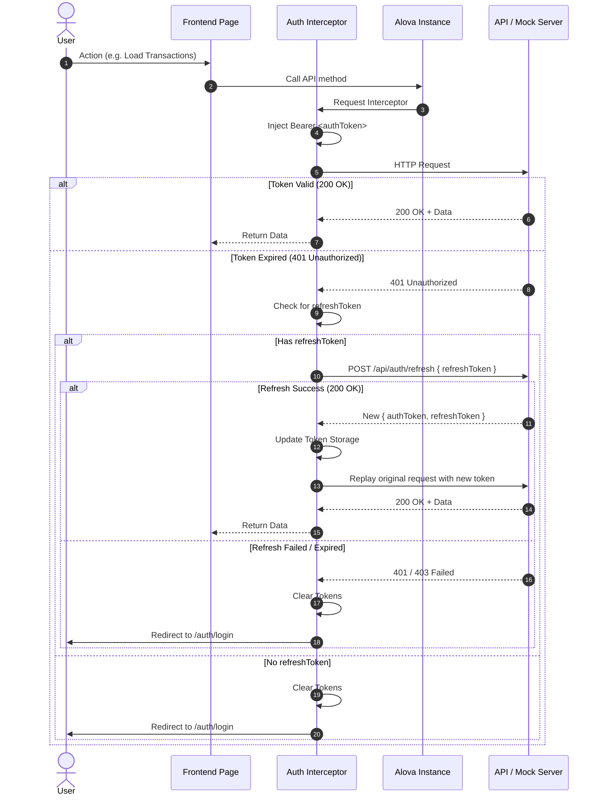

# FINKING — Modern Financial Dashboard

A fintech dashboard application built with **Next.js (Pages Router)**, **TypeScript**, **Tailwind CSS**, and **Alova.js**.

---

## Architecture & Authentication

### 1. Route Guard & Access Flow

All dashboard routes (`/dashboard/*`) and the root URL (`/`) are protected by route guards. If `authToken` or `refreshToken` is missing, the user is redirected to `/auth/login`. Authenticated users visiting `/auth/login` or `/` are redirected to the dashboard.

```mermaid
flowchart TD
    Start([User visits URL]) --> CheckPath{Requested Path}

    CheckPath -->|Root: /| CheckAuthRoot{Has Token?}
    CheckAuthRoot -->|No| ToLogin[Redirect to /auth/login]
    CheckAuthRoot -->|Yes| ToDashboard[Redirect to /dashboard/statistics]

    CheckPath -->|/auth/login| CheckAuthLogin{Has Token?}
    CheckAuthLogin -->|Yes (GuestGuard)| ToDashboard
    CheckAuthLogin -->|No| RenderLogin[Render Login Page]

    CheckPath -->|Dashboard: /dashboard/*| CheckAuthDash{Has Token? (AuthGuard)}
    CheckAuthDash -->|No| RedirectLogin[Redirect to /auth/login?redirect=path]
    CheckAuthDash -->|Yes| RenderDash[Render Dashboard Page]
```

---

### 2. API Request Interceptor & Automatic Token Refresh

API requests are managed through **Alova.js** with centralized request/response interceptors:
- **Request Interceptor**: Injects `Authorization: Bearer <authToken>` into outgoing headers.
- **Response Interceptor**: Catches `401 Unauthorized` responses and automatically attempts token renewal using the `refreshToken`. Upon success, original requests are replayed seamlessly.



---

## Features

- **Authentication**: JWT token management (`authToken`, `refreshToken`), AuthGuard, GuestGuard, automatic token renewal.
- **Dashboard Overview & Statistics**: Real-time KPI summaries, dynamic revenue & category distribution charts.
- **Users Management**: Paginated user table, live search filtering, user creation and edit modals, CSV/JSON export.
- **Transactions Management**: Paginated transactions history, status badges, CSV/JSON export.
- **Fake / Mock Endpoints**: Fully testable locally using `@alova/mock` with one-toggle switch to real endpoints via `.env`.
- **Internationalization (i18n)**: English localization powered by `next-intl`.

---

## Project Structure

```
FINKING-FRONTEND/
├── core/                       # Core application utilities
│   ├── api/                    # Alova instance & mock adapters
│   ├── auth/                   # Token service & credentials storage
│   ├── i18n/                   # Translation config & loaders
│   └── store/                  # Redux store
├── features/                   # Domain features
│   ├── auth/                   # Authentication domain (login, layouts, mocks)
│   ├── dashboard/              # Shared dashboard shell & navigation
│   ├── statistics/             # Statistics charts, KPIs & API
│   ├── transactions/           # Transactions list, export & API
│   └── users/                  # Users CRUD, form modal, export & API
├── pages/                      # Next.js Pages Router routes
│   ├── _app.tsx                # App entrypoint (Redux + next-intl)
│   ├── index.tsx               # Root redirector
│   ├── auth/login/             # Login route
│   └── dashboard/              # Protected dashboard pages
├── shared/                     # Cross-cutting UI tokens, components, guards
│   ├── components/common/      # Button, Input, Table, Pagination
│   ├── components/guards/      # AuthGuard, GuestGuard
│   ├── interceptors/           # Auth request & response interceptors
│   └── utils/                  # Download helpers
└── styles/                     # Tailwind & global CSS
```

---

## Getting Started

### 1. Install Dependencies

```bash
npm install
```

### 2. Environment Configuration

Copy `.env.example` to `.env.local`:

```bash
cp .env.example .env.local
```

| Variable | Description | Default |
| :--- | :--- | :--- |
| `NEXT_PUBLIC_API_URL` | Base URL of your backend API | `""` (local mock) |
| `NEXT_PUBLIC_ENABLE_MOCKS` | Enable/disable in-browser fake mock endpoints | `true` |

### 3. Run Development Server

```bash
npm run dev
```

Visit [http://localhost:3000](http://localhost:3000). You will be automatically redirected to `/auth/login` (or `/dashboard/statistics` if already logged in).

### 4. Build for Production

```bash
npm run build
npm start
```
