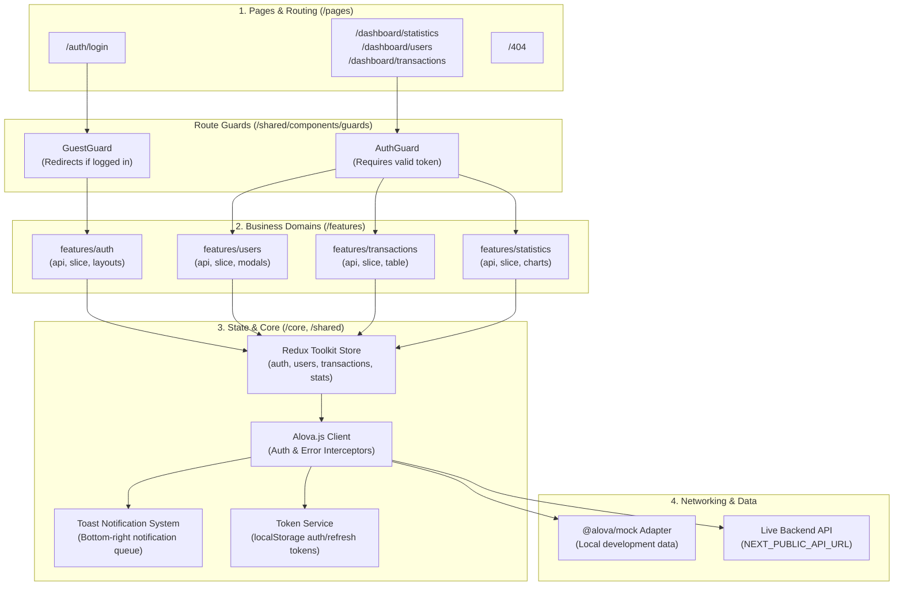
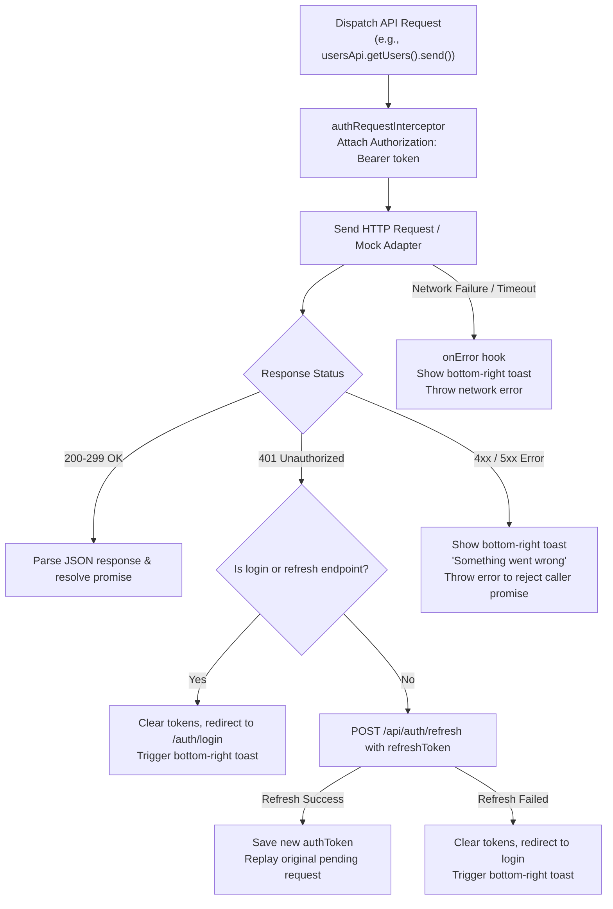

# FINKING Frontend

Financial management dashboard built with Next.js (Pages Router), TypeScript, Redux Toolkit, Tailwind CSS v4, Alova.js, and Oxlint.

---

## 1. Architecture Overview

The application follows a domain-driven, feature-sliced architecture. Code is organized into three main layers: `pages/` for routing, `features/` for isolated business domains, and `core/` / `shared/` for infrastructure and reusable UI primitives.

### System Architecture Diagram



---

## 2. Request & Error Lifecycle

All API requests pass through `alovaInstance` (`core/api/alova.ts`). The lifecycle handles token attachment, silent token refresh on 401s, request retries, and global error toasts.

### Request Flow Diagram



---

## 3. Core Tools & Technologies

| Tool | Purpose | Key Details |
| :--- | :--- | :--- |
| **Next.js 16 (Pages Router)** | Framework & SSR/SSG | Uses `pages/` directory with `getStaticProps` for static message preloading. |
| **TypeScript 5** | Static Typing | Strict type checking (`noEmit`), interfaces for DTOs and API responses. |
| **Redux Toolkit** | Global State | Centralized store (`core/store/store.ts`) with domain slices (`users`, `transactions`, `auth`). |
| **Alova.js 3** | HTTP Client | Lightweight request client with interceptor pipeline and seamless mock integration. |
| **@alova/mock** | Mock Backend | Client-side mock adapter enabled by default for isolated local development. |
| **Tailwind CSS v4** | Styling | Modern CSS-first Tailwind (`@import "tailwindcss"; @theme`) with design tokens. |
| **Oxlint** | Fast Linting | Rust-based linter executing in under 20ms to catch React and TypeScript bugs. |
| **ESLint 9** | Secondary Linting | Next.js rules and additional code quality checks. |
| **next-intl** | Internationalization | Dynamic namespace loading (`core/i18n/loader.ts`) for modular domain locales. |

---

## 4. Linting with Oxlint

This project uses [Oxlint](https://oxc.rs/docs/guide/usage/linter.html) as the primary linter for rapid developer feedback, paired with ESLint.

### Why Oxlint?
- **Speed**: Lints the entire 100+ file codebase in under **20 milliseconds**.
- **Targeted rules**: Catches React hook bugs, key errors, bad mutation states, and TypeScript pitfalls without configuration overhead.

### Configuration (`.oxlintrc.json`)
The rules are defined in `.oxlintrc.json`:
- **Plugins enabled**: `react`, `typescript`, `nextjs`, `unicorn`, `oxc`, `import`, `promise`.
- **Categories**:
  - `correctness`: Treated as errors (e.g., broken hook dependencies, invalid syntax).
  - `suspicious` & `perf`: Emitted as warnings (e.g., inefficient map-spreads, dead code).
- **Custom rule overrides**:
  - `react/react-in-jsx-scope`: Turned off (obsolete in modern React 19).
  - `typescript/no-unused-vars`: Warns on unused variables (ignoring `^_` prefixed arguments).
  - `nextjs/no-async-client-component`: Enforces Next.js component constraints.

### Lint Commands
```bash
# Run ultra-fast oxlint
npm run lint:oxlint

# Run standard ESLint
npm run lint:eslint

# Run both in sequence
npm run lint
```

---

## 5. Domain-Driven Project Structure

```
FINKING-FRONTEND/
├── assets/                     # Global static icons and SVG assets
│   └── icons/                  # Brand logos (logo.svg, logo-mark.svg)
├── core/                       # Shared platform infrastructure
│   ├── api/                    # Alova instance and mock toggle helpers
│   ├── auth/                   # Token storage service (localStorage)
│   ├── i18n/                   # Translation config and namespace loaders
│   └── store/                  # Redux root store and typed hooks
├── features/                   # Business domain modules
│   ├── auth/                   # Login page, layouts, auth API, auth guards
│   ├── dashboard/              # Shared dashboard layout, sidebar, user menu
│   ├── statistics/             # Revenue charts, volume distribution, KPI cards
│   ├── transactions/           # Transaction table, details view, export
│   └── users/                  # User management, create/edit modals, export
├── pages/                      # Next.js Pages router routes
│   ├── _app.tsx                # App wrapper, Redux provider, Toast provider
│   ├── 404.tsx                 # Not found page
│   ├── auth/login.tsx          # Login route
│   └── dashboard/              # Protected dashboard routes
├── public/                     # Public static assets & favicon.svg
├── shared/                     # Reusable UI primitives
│   ├── components/common/      # Button, Input, Modal, Table, Pagination, Toast
│   ├── components/guards/      # AuthGuard, GuestGuard
│   └── interceptors/           # Auth request and response interceptors
└── styles/                     # Tailwind CSS and global keyframe animations
```

---

## 6. Development & Running Modes

### Mock vs Live Backend
The project can run entirely self-contained without a running backend server using client-side mocks:

- **Toggle via `.env.local`**:
  ```env
  NEXT_PUBLIC_ENABLE_MOCKS=true
  NEXT_PUBLIC_API_URL=http://localhost:8080
  ```
- **Toggle at runtime in browser console**:
  ```js
  // Disable mocks to test live endpoints or error responses
  window.__FINKING_MOCKS__.setEnabled(false);

  // Re-enable mocks
  window.__FINKING_MOCKS__.setEnabled(true);
  ```

### Getting Started

1. **Install dependencies**:
   ```bash
   npm install
   ```

2. **Run development server**:
   ```bash
   npm run dev
   ```
   Open [http://localhost:3000](http://localhost:3000).

3. **Typecheck & Lint**:
   ```bash
   npx tsc --noEmit
   npm run lint:oxlint
   ```

4. **Production build**:
   ```bash
   npm run build
   npm start
   ```
