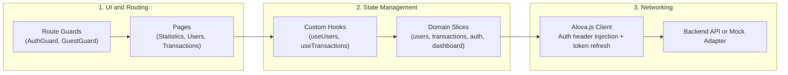

# FINKING Frontend

Financial management dashboard built with Next.js (Pages Router), TypeScript, Redux Toolkit, Tailwind CSS, and Alova.js.

---

## Architecture Overview

The codebase is organized by business domains (Feature-Sliced structure).



---

## Technical Details

### Authentication and Route Guards
- `AuthGuard`: Restricts `/dashboard/*` to authenticated sessions. Unauthenticated requests redirect to `/auth/login?redirect=<path>`.
- `GuestGuard`: Prevents authenticated users from viewing `/auth/login`, redirecting them to `/dashboard/statistics`.
- Root path (`/`) redirects based on authentication status.

### Token Management and Interceptor
- Outgoing requests attach `Authorization: Bearer <authToken>`.
- On `401 Unauthorized`, the response interceptor requests a new token pair using `refreshToken` and replays the failed request.
- If refresh fails, stored tokens are cleared and the user is redirected to `/auth/login`.

### Domain-Driven Feature Structure
Features are modularized under `features/<domain>`:
- `auth`: Login, authentication guards, and token state.
- `users`: User list, create/edit modals, field-level filters, and export.
- `transactions`: Transactions table, detail view, status management, and export.
- `statistics`: Overview charts (revenue, category breakdown) and KPI metrics.

Each domain maintains its own components, Redux slice, API methods, and mock data.

### Mock and Live Backend Modes
The app can run against local mocks (`@alova/mock`) or a live API via `.env.local`:
```env
NEXT_PUBLIC_ENABLE_MOCKS=true
NEXT_PUBLIC_API_URL=
```

---

## Project Structure

```
FINKING-FRONTEND/
├── core/                       # Shared infrastructure (API client, auth storage, i18n, store)
├── features/                   # Domain modules (auth, dashboard, statistics, transactions, users)
├── pages/                      # Next.js Pages router routes
├── shared/                     # Reusable UI components (Table, Input, Button, Modal, Toast)
└── styles/                     # Global styles and Tailwind configuration
```

---

## Getting Started

### Prerequisites
- Node.js 18+
- npm

### Installation
```bash
npm install
```

### Environment Setup
```bash
cp .env.example .env.local
```

### Development
```bash
npm run dev
```
Open [http://localhost:3000](http://localhost:3000).

### Build
```bash
npm run build
npm start
```
