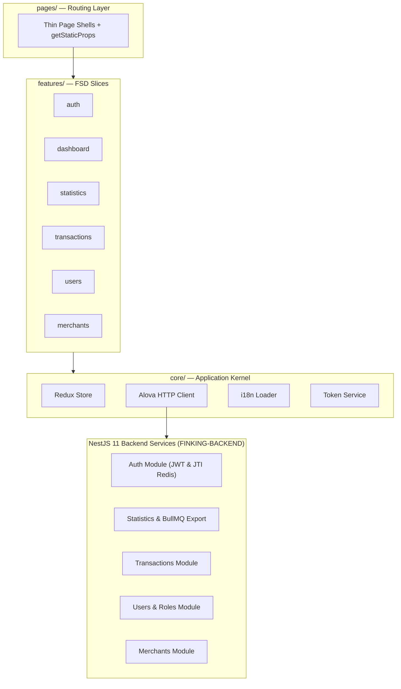

# FinKing Frontend — Next.js 16 & React 19 Financial Operations Dashboard


A web dashboard for managing financial operations, transactions, and users. Built with **Next.js 16 (Pages Router)**, **React 19**, **Redux Toolkit**, **Alova 3**, and **Tailwind CSS v4**.

This frontend connects to the [FinKing Backend API](https://github.com/swe-rashad/FINKING-BACKEDN) and supports role-based access control, analytics charts, transaction filters, and automated report exports via email.

---

## 🚀 Main Features

- **📊 Statistics & Analytics**: Dashboard with key metrics (Total Revenue, Transaction Count, Active Users, Average Amount), monthly revenue charts, and category breakdown. Includes asynchronous Excel report exports via email.
- **💸 Transaction Management**: Paginated transaction table with filters for status, type, date range, currency, sender, and receiver. Supports single transaction details and background Excel exports.
- **👥 User Management**: User directory with role filtering (Admin, Employee, Customer), user editing, creation, and one-click account blocking/unblocking with instant UI updates.
- **🏢 Merchant Profile**: View and update current merchant account settings.
- **🔐 Authentication & Access Control**: Full JWT auth flow (sign-in, sign-up, token refresh, and logout). The sidebar, page routes, and action buttons automatically adapt to the user's role and assigned permissions.
- **⚡ Dual Mode (Mock & Live)**: Includes a built-in mock adapter (`@alova/mock`) for frontend-only development, which can easily be switched to the live backend API.

---

## 🏗️ Project Architecture

The project is organized using **Feature-Sliced Design (FSD)**. The `pages/` directory only handles routing, while business logic, UI components, Redux slices, and API calls are grouped inside their respective feature folders under `features/`.


```mermaid
flowchart TB
  subgraph pagesLayer ["pages/ — Routing Layer"]
    routes["Thin Page Shells + getStaticProps"]
  end

  subgraph featuresLayer ["features/ — FSD Slices"]
    auth["auth"]
    dashboard["dashboard"]
    statistics["statistics"]
    transactions["transactions"]
    users["users"]
    merchants["merchants"]
  end

  subgraph coreLayer ["core/ — Application Kernel"]
    store["Redux Store"]
    alova["Alova HTTP Client"]
    i18n["i18n Loader"]
    tokens["Token Service"]
  end

  subgraph backendLayer ["NestJS 11 Backend Services (FINKING-BACKEND)"]
    authBE["Auth Module (JWT & JTI Redis)"]
    statsBE["Statistics & BullMQ Export"]
    txBE["Transactions Module"]
    usersBE["Users & Roles Module"]
    merchantsBE["Merchants Module"]
  end

  routes --> featuresLayer
  featuresLayer --> coreLayer
  alova --> backendLayer
```

### 📁 Directory Layout

```
pages/                 Next.js routing surface only (re-exports feature pages)
features/
  auth/                Authentication UI, JWT API, login/register thunks, mocks
  dashboard/           Layout shell, sidebar, header, global nav
  statistics/          KPI metrics, charts, last transactions, export thunk
  transactions/        Paginated table, filter modals, details page, export thunk
  users/               User directory, user modal, block/unblock, edit profile
  merchants/           Merchant profile API & mock handlers
core/
  api/                 Alova instance config, dynamic fetch/mock adapter switcher
  auth/                Token storage, safe redirect utilities
  i18n/                Internationalization message preloading
  store/               Redux Toolkit root store & feature slice registration
shared/
  components/          Atomic UI components (Buttons, Inputs, Modals, Toast)
  guards/              AuthGuard & GuestGuard HOCs
  hooks/               Utility hooks (click-outside, escape key, body lock)
  interceptors/        JWT Bearer header injection & 401 silent token refresh
```

---

## 🔌 API Integration Mapping with FINKING-BACKEND

| Frontend Feature | API Endpoint | HTTP Method | Backend Service |
| --- | --- | --- | --- |
| **Auth** | `/auth/sign-in` | `POST` | AuthController.signIn |
| **Auth** | `/auth/sign-up` | `POST` | AuthController.signUp |
| **Auth** | `/auth/refresh-token` | `GET` | AuthController.refreshToken |
| **Auth** | `/auth/logout` | `POST` | AuthController.logout |
| **Statistics** | `/statistics/revenue-overview` | `GET` | StatisticsController.getRevenueOverview |
| **Statistics** | `/statistics/category-distribution` | `GET` | StatisticsController.getCategoryDistribution |
| **Statistics** | `/statistics/total-revenue` | `GET` | StatisticsController.getTotalRevenue |
| **Statistics** | `/statistics/total-transactions` | `GET` | StatisticsController.getTotalTransactions |
| **Statistics** | `/statistics/avarage-transaction-amount` | `GET` | StatisticsController.getAvarageTransactionAmount |
| **Statistics** | `/statistics/active-users` | `GET` | StatisticsController.getActiveUsers |
| **Statistics** | `/statistics/get-last-transactions` | `GET` | StatisticsController.getLastTransactions |
| **Statistics** | `/statistics/export` | `POST` | StatisticsController.exportStatistics (BullMQ) |
| **Transactions** | `/transactions` | `GET` | TransactionsController.getTransactions |
| **Transactions** | `/transactions/:id` | `GET` | TransactionsController.getTransactionById |
| **Transactions** | `/transactions/export` | `POST` | TransactionsController.exportTransactions (BullMQ) |
| **Users** | `/users` | `GET` | UsersController.getUsers |
| **Users** | `/users/create` | `POST` | UsersController.createUser |
| **Users** | `/users/current` | `GET` | UsersController.getCurrentUser |
| **Users** | `/users/:id` | `GET` | UsersController.getUserById |
| **Users** | `/users/:id` | `PATCH` | UsersController.updateUser |
| **Users** | `/users/:id/block` | `PATCH` | UsersController.blockUser |
| **Merchants** | `/merchants/current` | `GET` | MerchantsController.getCurrentMerchant |
| **Merchants** | `/merchants/current` | `PATCH` | MerchantsController.updateCurrentMerchant |

---

## 🛠️ Technology Stack Detail

- **Next.js 16 (Pages Router)**: Modern React SSR/SSG web framework with fast page loads and localized static prop resolution.
- **React 19**: Concurrent renderer with enhanced hooks.
- **Redux Toolkit**: Predictable global state management for feature domains (`useUsers`, `useTransactions`, `useStatistics`).
- **Alova 3**: Lightweight HTTP request strategy library with built-in mock adapter, request deduplication, and automated token retry interceptors.
- **Tailwind CSS v4**: Utility-first styling engine with customized `@theme` design tokens and responsive glassmorphism themes.
- **next-intl**: Flexible internationalization framework supporting multi-language locale switching.
- **Oxlint & ESLint**: Dual linting pipeline for ultra-fast Rust-powered lint checks and strict code style enforcement.

---

## 💻 Quick Start & Running Locally

### Prerequisites
- Node.js 20+
- pnpm / npm 10+
- Running instance of [FINKING-BACKEND](https://github.com/swe-rashad/FINKING-BACKEDN) (Optional if using Mock Mode)

### 1. Clone & Install
```bash
git clone https://github.com/swe-rashad/FINKING-FRONTEND.git
cd FINKING-FRONTEND
pnpm install
```

### 2. Configure Environment
Create `.env.local` in the root directory:
```env
NEXT_PUBLIC_ENABLE_MOCKS=false
NEXT_PUBLIC_API_URL=http://localhost:8080
```
> Note: Set `NEXT_PUBLIC_ENABLE_MOCKS=true` if running without the NestJS backend.

### 3. Run Development Server
```bash
pnpm dev
```
Open [http://localhost:3000](http://localhost:3000) in your browser.

---

## 📜 Available NPM Scripts

| Script | Command | Description |
| --- | --- | --- |
| `pnpm dev` | `next dev` | Launches local development server |
| `pnpm build` | `next build` | Compiles optimized production bundle |
| `pnpm start` | `next start` | Runs production server |
| `pnpm typecheck` | `tsc --noEmit` | Runs TypeScript static type checking |
| `pnpm lint` | `oxlint && eslint` | Executes full linting suite |
| `pnpm lint:oxlint` | `oxlint` | Fast Oxlint code analysis |
| `pnpm lint:eslint` | `eslint` | ESLint style enforcement |

---

## 🔗 Related Repositories

- ⚙️ **Backend Application**: [swe-rashad/FINKING-BACKEDN](https://github.com/swe-rashad/FINKING-BACKEDN) — NestJS 11, PostgreSQL, TypeORM, BullMQ Queue Engine, Redis Token Rotation, Swagger API Docs.

---

## 📄 License

Distributed under the MIT License. See `LICENSE` for more information.
